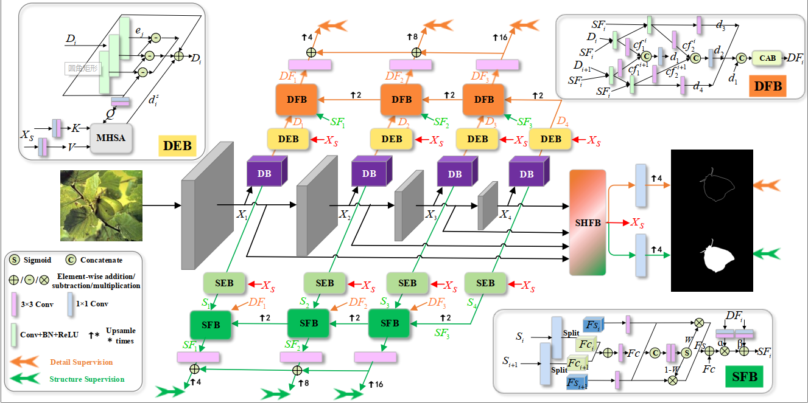

# SDRNet
**SDRNet: Camouflaged Object Detection with Independent Reconstruction of Structure and Detail**, submmit to KBS

[[Paper coming soon](https)] [[Results](https://drive.google.com/drive/folders/1Pho42bHiBhVR0l9KzdOFQgqLzr8mSv9e?usp=sharing)] SDRNet
[[Pretrained models](https://drive.google.com/file/d/1MONpM9auqGlRoyaOKUe6wJgLZ-E6A4Dc/view?usp=sharing)]

---
> **Abstract:** *The simultaneous reconstruction of structure and detail is a prevalent strategy in camouflaged object detection. However, the reconstruction features required for structure and detail exhibit disparities, a facet overlooked in existing methods. Therefore, we present a novel methodology, termed SDRNet, which employs a dual-branch approach for the independent reconstruction of structure and detail, aiming to discern camouflaged targets and their edges. Specifically, we propose a decomposition block to segregate encoded features into distinct structure and detail components. Furthermore, structure enhancement block and detail enhancement block are proposed as feature enhancement methods to boost the capacity of structure and detail information. Subsequently, the introduced structure fusion block and detail fusion block progressively amalgamate the enhanced features. Additionally, the shared feature block is designed to serve as a bridge for the interaction between structure and detail information. Experimental results demonstrate that SDRNet outperforms existing state-of-the-art methods significantly on benchmark datasets.*
>
> <p align="center">
> 
> </p>
---

## Usage

### 1. Training Configuration

- The pretrained model is stored in [Google Drive](https://drive.google.com/file/d/1MONpM9auqGlRoyaOKUe6wJgLZ-E6A4Dc/view?usp=sharing). After downloading, please change the file path in the corresponding code.
```bash
python Train.py  --epoch 100  --lr 1e-4  --batchsize 12  --trainsize 384  --train_root YOUR_TRAININGSETPATH  --val_root  YOUR_VALIDATIONSETPATH  --save_path YOUR_CHECKPOINTPATH
```

### 2. Testing Configuration

Our well-trained model is stored in [Google Drive](https://drive.google.com/file/d/1MONpM9auqGlRoyaOKUe6wJgLZ-E6A4Dc/view?usp=sharing). After downloading, please change the file path in the corresponding code.
```bash
python Test.py  --testsize YOUR_IMAGESIZE  --pth_path YOUR_CHECKPOINTPATH 
```

### 3. Evaluation

- Change the file path to your GT and testing path in [eval.py](https://github.com/whyandbecause/SDRNet/edit/main/evaltools/eval.py), then run it to get your evaluation results.

### 4. Results download

The prediction results of our SDRNet are stored on [Google Drive](https://drive.google.com/file/d/1MONpM9auqGlRoyaOKUe6wJgLZ-E6A4Dc/view?usp=sharing) please check.

### 5. Visualization
Change the params in cam.py as your setting, and run with
```bash
python cam.py  
```
the results will be saved.

model_weight_path: the trained model path;
target_layers: the layer your want to visualize. eg.[model.out_s4];
path: the path of dataset.

## Citation
If you find our work useful in your research, please consider citing:
{coming soon}

## Concat
If you have any questions, please feel free to contact me via email at jvguan@163.com or jvguan@seu.edu.cn.
